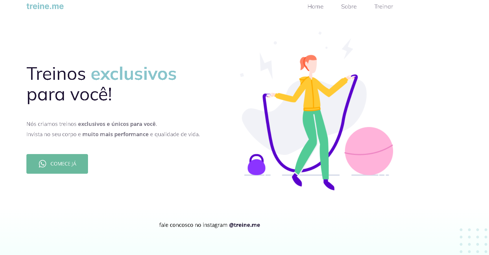

# Rocketseat - Stage 2 🚀

> Trilha Explorer - Projeto 02

Proposta desenvolvida como segundo projeto do curso Explorer da Rocketseat.

🛠 Tecnologias
- HTML
- CSS
- Git e GitHub

🤯 Aprimoramos conhecimentos já aplicados e vimos também:

- Semântica no HTML;
- Acessibilidade;
- Introdução à novas propriedades. 

Contato:
✉ marcsneves@hotmail.com
